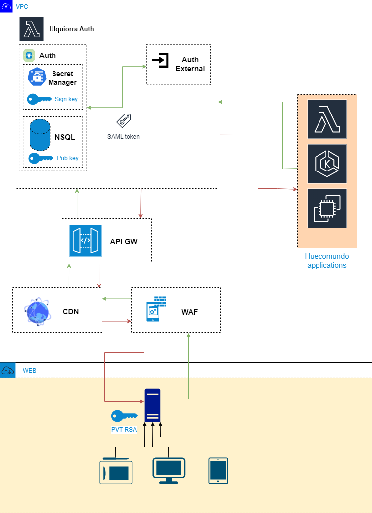

# `Project Huecomundo Ulquiorra Auth`

# Proposal

### Make yourself yours authorizations

Th proposal is create an authorizer compatible with other authorizer like `AWS Cognito / Azure AD B2C / Google identity platform` and inject it into other services and validate your  scopes and roles from `API GW`

